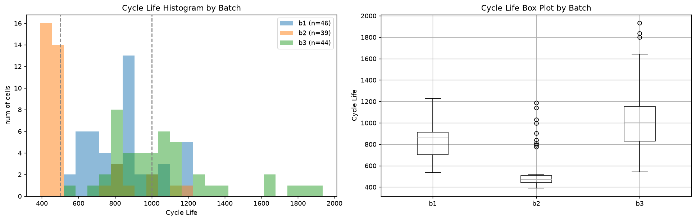
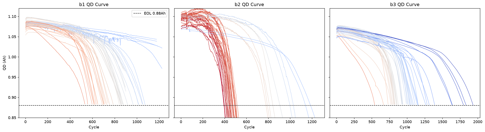
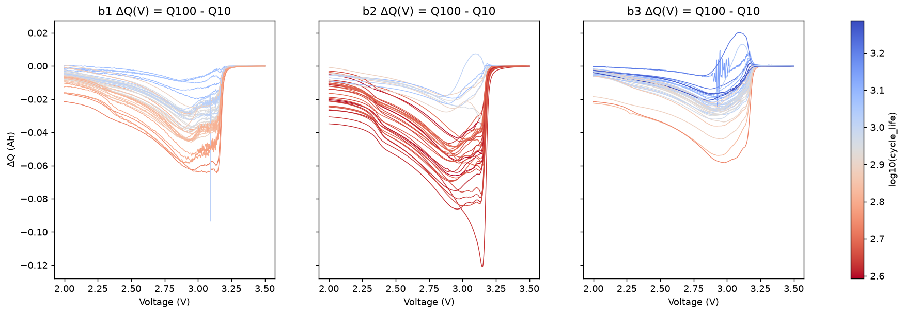
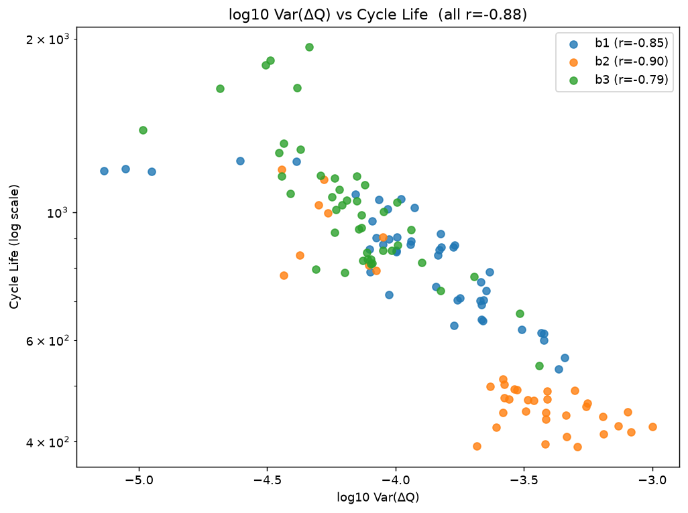
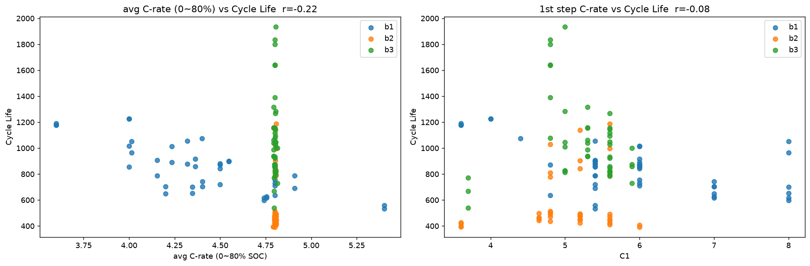
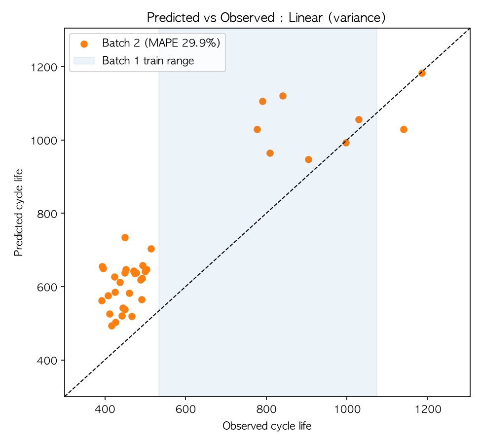
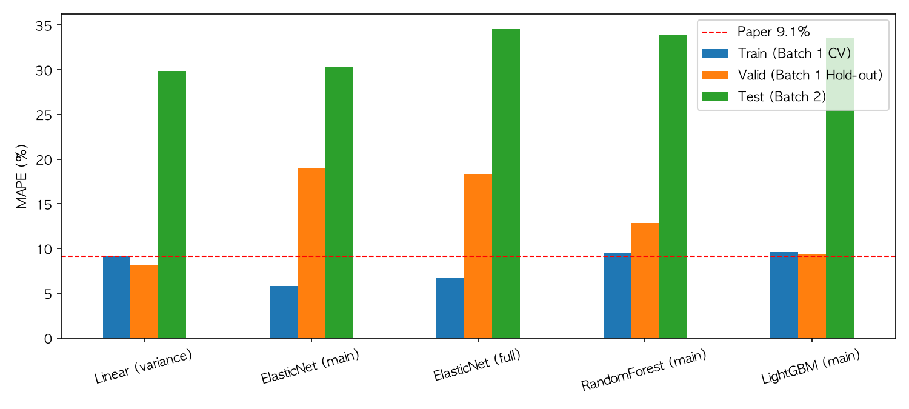
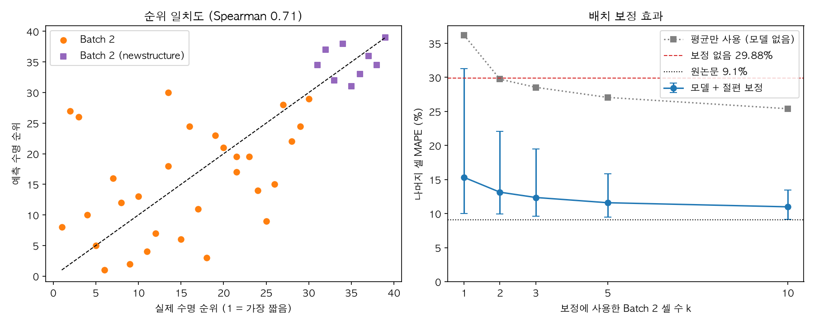
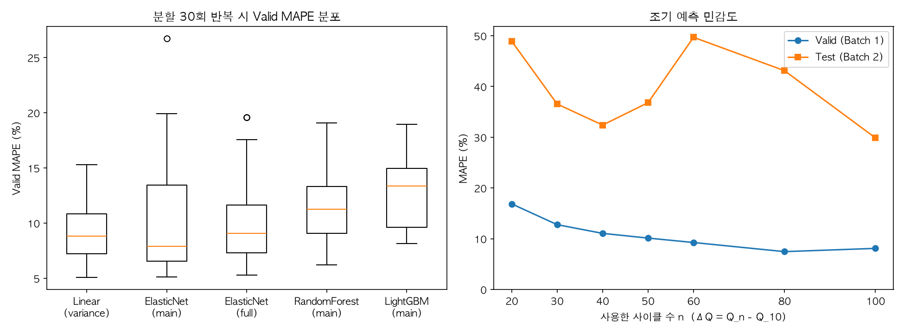

# ESS 배터리 수명 예측

열화가 본격화되기 전인 **초기 100 사이클** 데이터만으로 리튬이온 배터리의 수명(cycle life)을 예측한다.
수명을 실제로 측정하려면 수백~수천 사이클(수개월)이 필요하므로, 초기에 수명을 예측할 수 있으면 불량 셀 선별과 교체 계획에 활용할 수 있다.

## 프로젝트 개요

- 데이터셋 : MIT-Stanford Battery Dataset (Severson et al., Nature Energy 2019)
- 학습 데이터 : Batch 1 (2017-05-12)
- 평가 데이터 : Batch 2 (2018-02-20)
- 태스크 : **Regression (Cycle Life 예측)**, target = `log10(cycle_life)`, 지표 = MAPE

## 파일 구조

```
├── data/
│   └── README.md                     # 데이터 내려받기 · 변환 방법
├── notebooks/
│   ├── 01_EDA.ipynb                  # 정제 확인 + EDA 5개 질문
│   ├── 02_feature_engineering.ipynb  # 피처 생성 · 배치별 상관 확인
│   ├── 03_modeling.ipynb             # 학습 · 평가 · 오류 분석
│   ├── 04_additional_experiments.ipynb  # 추가 실험 1, 2 (순위 예측, 배치 보정)
│   └── 05_robustness.ipynb           # 추가 실험 3, 4 (분할 안정성, 조기 예측)
├── src/
│   ├── config.py                     # 경로 · 상수
│   ├── preprocess.py                 # .mat → pkl 변환, 셀 정제
│   ├── features.py                   # 초기 100 사이클 피처
│   ├── eda.py                        # EDA 그래프
│   ├── train.py                      # 분할 · 학습 · 성능 리포팅
│   ├── extra.py                      # 추가 실험 1, 2
│   └── robustness.py                 # 추가 실험 3, 4
├── results/
│   ├── model_performance.csv         # 후보 모델별 성능 표
│   ├── performance.md                # 최종 모델 성능 (리포팅 양식)
│   ├── cleaning_report.csv           # 셀별 정제 결과 (제외 사유)
│   ├── test_errors.csv               # Batch 2 셀별 예측값 · 오차
│   ├── features.csv                  # 셀별 피처 테이블
│   ├── extra_experiments.md          # 추가 실험 1, 2 결과 표
│   ├── robustness.md                 # 추가 실험 3, 4 결과 표
│   └── *.png                         # eda_*, pred_vs_obs, mape_compare, coef, extra_experiments, robustness
├── requirements.txt
└── README.md
```

## 환경 설정

```bash
git clone https://github.com/sihyun1223p-creator/ess-battery-project
cd ess-battery-project
pip install -r requirements.txt
# data/ 폴더에 b1/b2/b3_cells.pkl 준비 (data/README.md 참고)
python src/train.py     # 학습 · 평가 → results/
python src/extra.py     # 추가 실험 1, 2
python src/robustness.py  # 추가 실험 3, 4
```

## EDA

그래프는 `notebooks/01_EDA.ipynb`에서 생성한다.

- Cycle Life 분포
  - (정제 전 기준) Batch 1은 534~1,227(평균 845), Batch 2는 392~1,186(평균 566), Batch 3는 541~1,935(평균 1,060)
  - 단수명(<500) 비율 : Batch 1 0% / Batch 2 72% / Batch 3 0%, 장수명(>1000) 비율 : 22% / 8% / 52%
  - 핵심 발견 : 학습 배치에 단수명 셀이 없어 분류(550 기준)는 학습이 어렵고, 테스트 배치는 학습 범위 밖(외삽)을 포함한다 → 회귀 + log 타겟 + 외삽 가능한 모델

  

- 열화 곡선 분석
  - 모든 셀이 초기에는 평탄하다가 급락하는 가속 열화. 수명으로 정규화하면 장·단수명 셀의 곡선 형태가 거의 같다
  - Knee point는 수명의 약 73~80% 지점에서 발생 (knee–수명 r = 0.95)
  - 핵심 발견 : 급락이 수명 후반에 시작되므로 초기 100 사이클의 용량(QD) 값만으로는 수명을 구분하기 어렵다

  

- ΔQ(V) 곡선 분석
  - ΔQ(V) = Q(cycle 100) − Q(cycle 10). 단수명 셀일수록 3.0~3.2V 구간이 깊게 패이고, 장수명 셀은 평탄하다
  - log Var(ΔQ)와 log 수명의 상관 : Batch 1 −0.85 / Batch 2 −0.90 / Batch 3 −0.79
  - 핵심 발견 : 용량이 줄기 전에 이미 수명 정보가 담겨 있고, 세 배치에서 관계가 일관된 유일한 신호다
  - 단, Batch 2의 −0.90은 수명이 크게 다른 두 집단(단수명 셀 30개, newstructure 셀 9개)이 섞여 있어 높게 나온 값이다. 집단 안에서의 관계는 약하다 (추가 실험 1 참고)

  

  

- 충전 속도(C-rate)와 수명의 관계
  - Batch 1에서는 평균 C-rate가 높을수록 수명이 짧다 (r = −0.73)
  - Batch 2·3는 0~80% 평균 C-rate가 약 4.8C로 고정된 실험이어서 C-rate로 수명 차이를 설명할 수 없고, 같은 정책 안에서도 수명 표준편차가 최대 403 사이클이다
  - 핵심 발견 : 충전 조건만으로는 수명이 정해지지 않으며, 셀 고유 상태를 반영하는 피처가 필요하다

  

- 추가 확인
  - 충전시간·C-rate·온도는 배치마다 수명과의 상관 부호가 뒤집힌다 (예: 충전시간 +0.72 / −0.94 / +0.60)
  - Batch 1의 10셀은 방전용량이 EOL(0.88Ah)까지 떨어지지 않은 채 기록이 끝나 있다. 이런 셀의 `cycle_life`는 실제 수명보다 짧게 기록된 값이므로 학습에서 제외했다 (`results/cleaning_report.csv`)
  - 배치에 따라 index 0이 빈 사이클인 경우가 있어, 모든 셀을 "첫 유효 사이클" 기준으로 맞춘 뒤 cycle 10 / 100을 비교했다

## Modeling

### 피처 엔지니어링 전략

| 그룹 | 피처 | 근거 |
|---|---|---|
| ΔQ(V) 통계 | `dQ_logvar`, `dQ_min`, `dQ_skew`, `dQ_kurt` | 세 배치에서 수명과 일관된 강한 상관 |
| 초기 용량 | `QD_c2`, `QD_max_minus_c2`, `QD_slope_2_100` | 초기 상태 보완 |
| 내부 저항 | `IR_c2` | 초기 상태 보완 |
| 제외 (비교용 `full` 세트에만 포함) | `chargetime_mean`, `C_avg`, `Tavg_mean` 등 | 배치마다 상관 부호가 뒤집힘 |

### 모델 선택 및 근거

- 후보 모델 : Linear (`dQ_logvar` 1개) / ElasticNet (main 8개) / ElasticNet (full 13개) / RandomForest / LightGBM
- 최종 모델 : **Linear Regression (`dQ_logvar` 1개)** — Valid(Batch 1 Hold-out) MAPE가 가장 낮은 모델로 선택 (Test는 선택에 사용하지 않음)
- 선택 이유 :
  - log Var(ΔQ)–log 수명이 직선 관계이므로 선형 모델이 관계 구조에 맞는다
  - 학습 셀이 29개뿐이라 피처가 많은 모델은 불안정했다. ElasticNet(8개 피처)은 Train 5.77% → Valid 19.03%로 벌어진 반면, 피처 1개 모델은 9.16% → 8.09%로 안정적이었다
  - DAY 1 설계에서는 ElasticNet(main)을 메인으로 예상했으나, 검증 결과에 따라 더 단순한 모델을 최종으로 선택했다

### 검증 설계

- 정제 : EOL(0.88Ah)에 도달하지 않은 채 기록이 끝난 Batch 1의 10셀 제외 → 36셀 (수명 534~1,074)
- Valid : Batch 1 내 Hold-out 7셀. 같은 충전 정책의 셀이 train/valid에 나뉘지 않도록 **정책 단위**로 분리 (데이터 누수 방지)
- Train : 나머지 29셀에서 정책 단위 GroupKFold 평균. 하이퍼파라미터도 이 안에서만 선택
- Test : Batch 2 39셀. 모델 선택에 사용하지 않고 최종 평가에만 사용

## 성능 결과

최종 모델 : Linear Regression (`dQ_logvar`)

| 구분 | MAPE (%) | 비고 |
|---|---|---|
| Train (Batch 1 CV) | 9.16 | |
| Valid (Batch 1 Hold-out) | 8.09 | |
| Test (Batch 2) | 29.88 | |
| Gap (Train-Valid) | -1.07 | (+) : 과적합 의심 |
| Gap (Valid-Test) | +21.79 | (+) : 배치간 일반화 저하 의심 |
| Gap (Target-Test) | +20.78 | Target : 원논문 9.1% |

Gap은 MAPE가 오차 지표이므로 "뒤 − 앞"(Valid − Train, Test − Valid, Test − Target)으로 계산했다. (+)이면 뒤쪽 성능이 더 나쁘다.

- Gap (Train-Valid) −1.07 : 과적합 징후는 없다. 다만 Valid가 7셀이라 값의 변동이 크다
- Gap (Valid-Test) +21.79 : Batch 1 안에서는 8%대로 맞지만 Batch 2에서는 30%로, 배치 간 일반화가 되지 않았다
- Gap (Target-Test) +20.78 : 원논문 성능에 크게 못 미친다. 원인은 아래 오류 분석 참고

후보 모델 비교 (MAPE %)

| 모델 | Train (Batch 1 CV) | Valid (Batch 1 Hold-out) | Test (Batch 2) |
|---|---|---|---|
| Linear (variance) | 9.16 | 8.09 | 29.88 |
| ElasticNet (main) | 5.77 | 19.03 | 30.32 |
| ElasticNet (full) | 6.78 | 18.31 | 34.55 |
| RandomForest (main) | 9.53 | 12.82 | 33.91 |
| LightGBM (main) | 9.60 | 9.39 | 33.52 |

모델 종류와 무관하게 Test가 30~35%이므로, 성능 저하는 모델 선택보다 데이터(배치 차이)의 문제로 판단한다.





## 오류 분석

- 모델이 가장 크게 틀린 셀의 공통점
  - 오차 상위 9셀이 모두 수명 392~452의 단수명 셀이고, 전부 실제보다 길게 예측했다 (+40 ~ +67%)
  - Batch 2 39셀 중 30셀이 학습 수명 범위(534~1,074)보다 짧다. 구간별 MAPE : 범위 아래 34.1%(30셀) / 범위 안 19.0%(7셀) / 범위 위 5.0%(2셀)
  - ΔQ 피처 값이 학습 범위 안에 있는 셀(22셀)의 MAPE가 36.9%로, 범위 밖 셀(17셀, 20.8%)보다 오히려 크다
- 원인 가설
  - 피처가 처음 보는 값이어서 틀린 것이 아니라, **같은 ΔQ 값이라도 Batch 2 셀이 Batch 1 셀보다 일찍 수명이 끝난다.** 즉 "ΔQ → 수명" 관계 자체가 배치 사이에 아래로 이동해 있다
  - Batch 1에는 수명 534 미만 셀이 없어, 모델이 단수명 구간을 한 번도 학습하지 못했다
  - 배치 간 차이의 원인(제조 시기, 보관 기간, 실험 조건 등)은 이 데이터만으로는 확인할 수 없다
- 개선 방향
  - 새 배치에서 소수 셀의 실제 수명을 확보해 절편을 보정 (배치별 캘리브레이션)
  - 학습 데이터에 단수명 셀 포함 (여러 배치를 섞어 학습)
  - 절대 수명 대신 단수명/장수명 등급 예측으로 문제를 바꾸는 방안

## ESS 도메인 해석

- 실제 BESS에 적용한다면 어떤 의사결정에 활용 가능한가?
  - 초기 100 사이클 시점에 셀을 "단수명군 / 장수명군"으로 나누는 선별 용도. Batch 2에서 수명 550 미만 셀 30개와 이상 셀 9개를 모두 구분했다 (추가 실험 1)
  - 조기 열화가 예상되는 셀·모듈 묶음을 미리 분리하거나 점검 주기를 앞당기는 판단에 쓸 수 있다
  - 같은 군 안에서 어느 셀이 먼저 열화되는지는 맞히지 못하므로(순위상관 0.38), 개별 셀 단위의 교체 순서를 정하는 데는 쓸 수 없다
- 한계와 실 배포를 위해 추가로 필요한 것
  - 이 모델은 수명을 실제보다 길게 예측하는 방향으로 틀린다. 교체 시점을 늦게 잡게 되므로 운영상 위험한 방향의 오차다. 예측값을 교체 일정에 그대로 쓰면 안 된다
  - 새로운 생산 배치·운영 조건마다 보정이 필요하다. 새 배치에서 3~5셀의 실제 수명을 확보해 보정하면 오차가 약 30% → 12%로 줄었다 (추가 실험 2). 다만 그 셀들의 수명이 끝날 때까지 기다려야 한다는 비용이 있다
  - 실험실의 정해진 충방전 조건 데이터여서, 실제 ESS의 부분 충방전·온도 변화·휴지 기간에서는 ΔQ(V)를 같은 방식으로 얻기 어렵다
  - 학습 29셀, 검증 7셀로 표본이 매우 작아 성능 추정 자체의 불확실성이 크다. 실제로 Hold-out 셀을 바꾸면 선택되는 모델이 달라졌다 (추가 실험 3)

## 추가 실험

공식 성능 표와 별개로, 오류 분석에서 세운 가설과 모델 선택의 신뢰도를 확인하기 위해 수행했다. 실험 1, 2는 최종 모델(Linear, `dQ_logvar`)의 Batch 2 예측값을 그대로 사용한다 (`src/extra.py`, `notebooks/04_additional_experiments.ipynb`). 실험 3, 4는 `src/robustness.py`, `notebooks/05_robustness.ipynb`에 있다.

### 실험 1. 순위 예측 성능

- 질문 : 절대 수명은 30% 틀리지만, "어느 셀이 먼저 열화되는가"의 순서는 맞는가?
- 방법 : Batch 2에서 예측 수명과 실제 수명의 Spearman 순위상관, 수명 하위 25% 셀 선별 적중 수, 단수명(<550) 판별 AUC를 계산했다. Batch 2에는 수명이 긴 newstructure 셀 9개가 섞여 있어, 이 집단을 나눈 경우도 따로 확인했다.

| 대상 | 셀 수 | Spearman 순위상관 | 하위 25% 선별 적중 | 단수명(<550) 판별 AUC | MAPE(%) |
|---|---|---|---|---|---|
| Batch 2 전체 | 39 | 0.708 | 5/10 | 1.0 | 29.88 |
| newstructure 제외 | 30 | 0.379 | 3/8 | - | 34.09 |
| newstructure만 | 9 | 0.226 | 0/2 | - | 15.86 |

(AUC "-" : 해당 집단에는 단수명 또는 장수명 셀만 있어 계산할 수 없음)

- 해석
  - 전체 순위상관 0.71과 AUC 1.0은 대부분 **두 집단(수명 400대 셀 30개 vs newstructure 셀 9개)을 구분한 결과**다. 모델은 100 사이클 시점에 "단수명군인지 장수명군인지"는 정확히 구분했다
  - 반면 같은 집단 안에서는 순위상관이 0.38, 0.23으로 낮고, 수명 하위 25% 선별도 절반(5/10)만 맞혔다. **집단 안에서 어느 셀이 먼저 열화되는지는 맞히지 못한다**
  - 단수명군 30셀은 수명이 392~500 정도로 좁게 몰려 있어 순서를 가리기 어려운 조건이기도 하다
  - 두 집단은 충전 정책(newstructure 여부)과 정확히 겹치므로, 모델이 구분한 것이 열화 정도인지 실험 조건의 차이인지는 이 데이터만으로 분리할 수 없다

### 실험 2. 배치 보정

- 질문 : 새 배치에서 셀 몇 개의 실제 수명만 알면 오차가 얼마나 줄어드는가?
- 방법 : Batch 2에서 무작위로 k셀을 골라 그 셀들의 평균 오차(log 스케일)만큼 예측값 전체를 이동(절편 보정)시키고, 나머지 셀에서 MAPE를 계산했다. 어떤 셀을 고르느냐에 따라 결과가 달라지므로 1,000회 반복했다. 모델 없이 k셀의 평균 수명을 그대로 예측값으로 쓴 경우("평균만 사용")와 비교했다.
- 주의 : Batch 2의 정답 일부를 사용하므로 Test 성능이 아니다. 성능 결과 표의 수치와 비교 대상이 아니라 "보정이 가능한 운영 환경이라면"의 참고 실험이다.

| 보정에 쓴 셀 수 k | 보정 후 MAPE 평균(%) | 5~95% 범위 | 평균만 사용 MAPE(%) |
|---|---|---|---|
| 1 | 15.32 | 10.0 ~ 31.3 | 36.22 |
| 2 | 13.14 | 10.0 ~ 22.1 | 29.74 |
| 3 | 12.36 | 9.6 ~ 19.5 | 28.54 |
| 5 | 11.59 | 9.5 ~ 15.8 | 27.06 |
| 10 | 10.99 | 9.2 ~ 13.5 | 25.40 |

- 보정 없음 : 29.88% / 전체 셀로 보정(참고용 상한) : 10.21%



- 해석
  - 셀 3~5개의 수명만 알아도 MAPE가 29.9% → 약 12%로 줄어든다. Batch 2 오차의 대부분이 **배치 전체가 한 방향으로 밀린 편향**이라는 오류 분석의 가설과 일치한다
  - 모델 없이 평균만 쓰면 25~36%에 머문다. 보정만으로 좋아진 것이 아니라, 모델(ΔQ)이 셀 간 차이를 구분해 주기 때문에 보정 효과가 난다
  - k=1일 때는 고른 셀에 따라 10~31%로 크게 흔들린다. 안정적인 보정에는 최소 3~5셀이 필요하다
  - 절편 하나만 보정했으므로 한계는 약 10%(전체 셀 사용 시 10.21%)이며, 실험 1에서 본 집단 내 순위 오차는 보정으로 줄어들지 않는다

### 실험 3. Valid 분할 안정성

- 질문 : Valid가 7셀뿐인데, Hold-out 셀을 다르게 뽑아도 같은 모델이 선택되는가?
- 방법 : Batch 1의 Train/Valid 분할(정책 단위, 20%)을 30번 바꿔 가며 5개 후보 모델을 다시 학습하고, 분할마다 Valid MAPE가 가장 낮은 모델을 기록했다. Valid 셀 수는 분할에 따라 6~8개였다.

| 모델 | Valid 1위 횟수 | Valid MAPE 평균(%) | Valid MAPE 표준편차 | Valid MAPE 최소~최대 | Test MAPE 평균(%) | Test MAPE 표준편차 |
|---|---|---|---|---|---|---|
| Linear (variance) | 9 | 9.19 | 2.44 | 5.1 ~ 15.3 | 28.88 | 0.92 |
| ElasticNet (main) | 12 | 10.50 | 5.56 | 5.1 ~ 26.7 | 36.12 | 7.29 |
| ElasticNet (full) | 5 | 9.91 | 3.85 | 5.3 ~ 19.6 | 39.52 | 6.65 |
| RandomForest (main) | 3 | 11.26 | 3.02 | 6.2 ~ 19.1 | 36.10 | 4.73 |
| LightGBM (main) | 1 | 12.85 | 3.20 | 8.1 ~ 18.9 | 38.90 | 6.28 |

- 분할마다 선택된 모델의 Test MAPE 평균 : 35.44%

- 해석
  - **한 번의 Hold-out으로 고른 모델은 분할에 따라 바뀐다.** 30번 중 Linear가 1위인 경우는 9번뿐이고, ElasticNet(main)이 12번으로 더 많았다. 성능 결과 표에서 Linear가 선택된 데에는 분할의 우연이 섞여 있다
  - 다만 30번을 평균하면 Linear가 Valid MAPE 평균이 가장 낮고(9.19%) 표준편차도 가장 작다(2.44). ElasticNet(main)은 잘 맞을 때는 1위지만 26.7%까지 나빠지는 분할도 있다. 여러 분할의 평균으로 고르면 Linear가 선택되므로, 최종 모델 자체는 유지한다
  - Test(Batch 2)에서도 Linear만 분할과 무관하게 일정했다(28.88 ± 0.92%). 피처가 많은 모델은 어떤 셀로 학습했는지에 따라 36~40% 안팎에서 크게 흔들렸다. (Test 수치는 모델 선택에 쓰지 않았고 사후 확인용이다)
  - 개선점 : 이 정도 표본에서는 단일 Hold-out 대신 반복 분할의 평균으로 모델을 선택하는 것이 맞다

### 실험 4. 조기 예측 민감도

- 질문 : 100 사이클까지 기다리지 않고 더 일찍 예측할 수 있는가?
- 방법 : ΔQ(V) = Q(cycle n) − Q(cycle 10)에서 n을 20~100으로 바꿔 가며 같은 Linear 모델을 학습·평가했다. 분할은 성능 결과 표와 동일하다.
- 주의 : Batch 2 수치는 n을 고르는 데 쓰지 않고 경향 확인용으로만 보고한다.

| 사용 사이클 n | Batch 1 상관 r | Valid MAPE(%) | Test MAPE(%) | Batch 2 단수명(<550) 판별 AUC |
|---|---|---|---|---|
| 20 | -0.375 | 16.86 | 48.93 | 0.793 |
| 30 | -0.719 | 12.77 | 36.55 | 0.889 |
| 40 | -0.814 | 11.05 | 32.40 | 0.889 |
| 50 | -0.696 | 10.12 | 36.81 | 0.930 |
| 60 | -0.826 | 9.25 | 49.70 | 0.800 |
| 80 | -0.834 | 7.45 | 43.12 | 0.996 |
| 100 | -0.837 | 8.09 | 29.88 | 1.000 |



- 해석
  - Batch 1 안에서는 사이클을 더 볼수록 좋아진다. n=20은 신호가 약하고(r = −0.38, Valid 16.9%), n=60부터 Valid MAPE가 10% 아래로 내려간다. 같은 배치 안이라면 60~80 사이클 시점에도 100 사이클과 비슷한 수준으로 예측된다
  - Batch 2에서는 n에 따라 Test MAPE가 30~50% 사이에서 들쭉날쭉하고 일정한 경향이 없다. 배치 간 편향이 사이클 수와 무관하게 남아 있다는 뜻이다
  - 단수명군 판별(AUC)은 n=100에서만 완전했다(1.000). n=80도 0.996으로 거의 같지만, n=60에서는 0.800으로 떨어져 안정적이지 않다
  - 정리하면 조기 예측은 같은 배치 안에서는 가능성이 있으나, 다른 배치로의 선별 용도라면 100 사이클을 다 쓰는 편이 안전하다. 표본이 작아(학습 29셀) n에 따른 차이의 일부는 우연일 수 있다

## 참고문헌

- Severson et al. (2019). Data-driven prediction of battery cycle life before capacity degradation. *Nature Energy*, 4, 383–391.

## 작성자

- 박시현 (울산캠퍼스 3반, U082)
